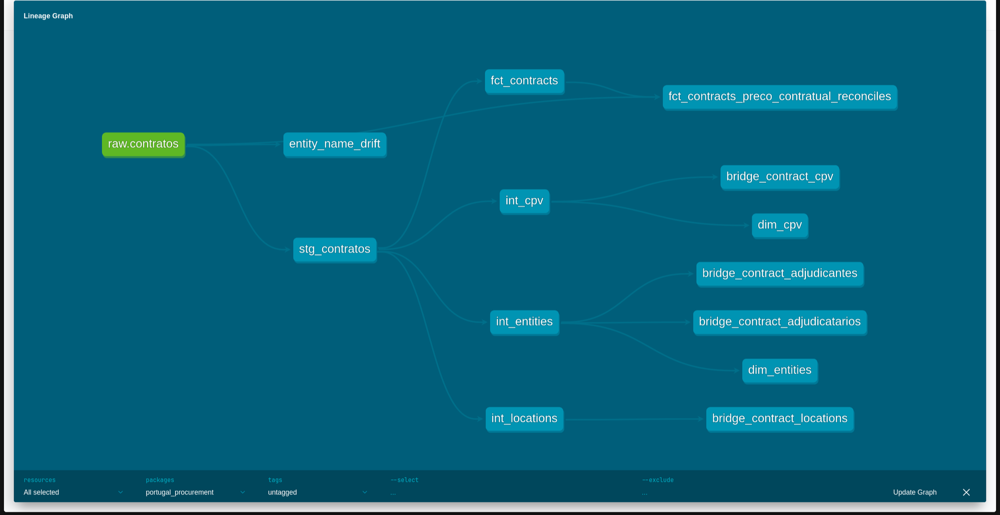

# Portuguese Public Procurement (dbt + DuckDB)

A dbt project that turns Portugal's public procurement data (base.gov.pt, mirrored on
dados.gov.pt) into a tested, queryable star schema. Built locally with DuckDB, no cloud
account required.

## What problem this solves

Every Portuguese public sector contract has to be published to base.gov.pt. The raw feed is a
genuine mess, not a tutorial dataset: 226,998 contract records for 2024, with 1,078 duplicate
rows from re-publishing, no reliable update timestamp anywhere in the schema, entity names that
drift across dozens of variants for the same company (one supplier alone has 72 raw name
variants), placeholder IDs standing in for individuals and foreign companies, and one-to-many
fields that go up to 218 locations or 40 CPV codes on a single contract.

This project models that into a star schema, `fct_contracts` plus dimension and bridge
tables, with 27 automated tests covering every layer from staging through marts. It's the same
kind of "does this number reconcile, can I trust this join" work I do for invoice reconciliation
at my current job, just applied to a public dataset and automated with dbt instead of done by
hand in Power Query.

## Architecture



## Stack

| Layer | Tool | Why |
|---|---|---|
| Extraction | `curl` + systemd timer | Pulls a fresh snapshot every 15 days, matching the source's own publish cadence |
| Storage | Local filesystem (raw JSON, gitignored) | No cloud spend required for this scope |
| Warehouse | DuckDB | Local, zero-config, real SQL engine |
| Transformation | dbt-core 1.12, dbt-duckdb 1.11 | Layered staging → intermediate → marts, tested, documented |
| Version control | git | Every model change is a real, reviewable commit |

## Design decisions and trade-offs

**Star schema, not one wide table.** Contracts have genuine one-to-many relationships, up to
218 locations, 40 CPV codes, and multiple suppliers or contracting authorities on a single
contract. Flattening any of these would either duplicate the contract's financial measures
(fan-out on a `SUM`) or silently drop data. `fct_contracts` stays at one-row-per-contract grain
holding the measures; everything with a real cardinality problem gets its own bridge table
(`bridge_contract_locations`, `bridge_contract_cpv`, `bridge_contract_adjudicantes`,
`bridge_contract_adjudicatarios`).

**Entity resolution: real ID first, normalized name as fallback.**
About 9.6% of supplier/authority entries have no real ID: individuals and foreign companies
without a Portuguese tax number. Where a real ID exists, it's the key. Where it doesn't, a
normalized name (case-folded, accents stripped, punctuation stripped) stands in. Cosmetic name
drift (case, punctuation, a stray leading-number artifact) gets cleaned before it's used as a key
or shown as a display name, but genuine ambiguity is documented, not resolved by guessing. The
display name for each entity is picked by frequency, and I checked that choice against a known
real-world case (a hospital's institutional rename to a regional health unit) before trusting it:
the recency signal in the data turned out unreliable even for that confirmed-real rename, so
frequency was the more defensible call, with the known limitation (a renamed entity's display
name can lag behind the current name) written up rather than quietly accepted.

**Locations parsed, not normalized into their own dimension.** Location strings are free text
with variable structure - country only, country plus region, or full country/district/
municipality. Parsed with `list_extract`, which nulls out missing parts automatically. Kept
denormalized directly in the bridge table rather than adding a separate `dim_locations`, since
the extra indirection wasn't worth it at this project's scale.

**Incremental model uses `merge`, not a timestamp filter.** The source has no reliable update
timestamp and republishes the *entire* current year's dataset on every 15-day pull, not just a
delta. A textbook `is_incremental()` timestamp filter would be fabricating a signal the data
doesn't have. `stg_contratos` instead uses a `merge` incremental strategy keyed on `idcontrato`:
new contracts get inserted, existing ones get upserted if their values changed, unchanged ones
are a no-op.

**Data quality issues are documented, not corrected.** A handful of things don't have a
confirmed root cause: 7 contracts with a negative contract value (at least 2 look like a
sign-entry error, unconfirmed), 45 cases where a well-established company ID has one rare stray
mismatched ID elsewhere in the data, a small population of contracts with no usable ID or name at
all. All of it is written up in [`data_quality_notes.md`](data_quality_notes.md) rather than
corrected by guessing. A wrong guess baked into the pipeline is harder to catch than a documented gap.

**Testing beyond schema-test basics.** Alongside standard `not_null`/`unique`/`relationships`
tests, there's a singular reconciliation test verifying that every contract's value in
`fct_contracts` still matches the raw source, end-to-end through dedup and every downstream
model - the same reconciliation logic I use at work, automated here instead of done by hand.

## How to run it

```bash
git clone <repo-url>
cd portugal-procurement-dbt
python3 -m venv venv
source venv/bin/activate
pip install dbt-core==1.12.2 dbt-duckdb==1.11.0

# pull a raw snapshot (not committed - gitignored)
./scripts/fetch_daily.sh

cd portugal_procurement
dbt build                              # runs every model and test end-to-end
dbt docs generate && dbt docs serve    # view the lineage graph and docs locally
```

## What I'd do differently

- Use the source's own coded `NUTs` geography field alongside the free-text location strings -
  `NUTs` is ~60% null on its own, so a hybrid of both would likely resolve more cases correctly
  than either alone.
- Add CI (GitHub Actions running `dbt build` on every push) instead of relying on local runs.
- Build the dbt snapshot (check-strategy, for tracking genuine cross-time changes like the
  `ContratEcologico` corrections found during data quality work) - designed in
  `data_quality_notes.md`, not yet built. Deprioritized in favor of finishing the core model
  first.
